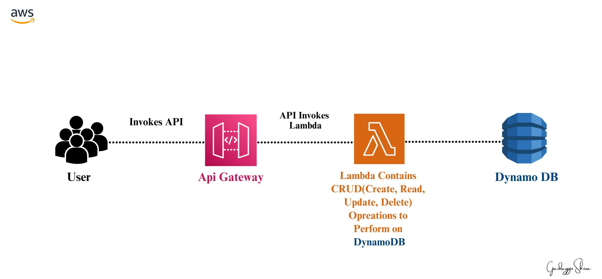

# Serverless API with AWS Lambda, DynamoDB, and API Gateway for Data Management

## Overview
This Document guides you through the process of setting up an Amazon API Gateway, a Lambda function, and a DynamoDB table. The API supports various DynamoDB operations and includes testing methods. The Lambda function is integrated with the API Gateway, allowing you to perform CRUD operations on a DynamoDB table.
## Architecture

## Setup

### Create Lambda IAM Role
1. Open the roles page in the IAM console.
2. Choose **Create role**.
3. Create a role named `lambda-apigateway-role` with permissions for DynamoDB and CloudWatch Logs.
    ```json
    {
        "Version": "2012-10-17",
        "Statement": [
            {
                "Sid": "Stmt1428341300017",
                "Action": [
                    "dynamodb:DeleteItem",
                    "dynamodb:GetItem",
                    "dynamodb:PutItem",
                    "dynamodb:Query",
                    "dynamodb:Scan",
                    "dynamodb:UpdateItem"
                ],
                "Effect": "Allow",
                "Resource": "*"
            },
            {
                "Sid": "",
                "Resource": "*",
                "Action": [
                    "logs:CreateLogGroup",
                    "logs:CreateLogStream",
                    "logs:PutLogEvents"
                ],
                "Effect": "Allow"
            }
        ]
    }
    ```

### Create Lambda Function
1. Click "Create function" in AWS Lambda Console.
2. Select "Author from scratch," name it `LambdaFunctionOverHttps`, choose Python 3.7 as Runtime.
3. Under Permissions, select "Use an existing role," and choose the `lambda-apigateway-role` from the drop-down.
4. Click "Create function."
5. Replace the code with the provided Python code snippet and click "Save."

### Test Lambda Function
1. Configure a test event with the following JSON:
    ```json
    {
        "operation": "echo",
        "payload": {
            "somekey1": "somevalue1",
            "somekey2": "somevalue2"
        }
    }
    ```
2. Click "Test" to execute the test event.

## Create DynamoDB Table
1. Open the DynamoDB console.
2. Choose "Create table."
3. Create a table named `lambda-apigateway` with the primary key as `id` (string).
4. Click "Create."

## Create API
1. Go to the API Gateway console.
2. Click "Create API" and select "Build" for REST API.
3. Name the API as `DynamoDBOperations` and click "Create API."
4. Click "Actions," then click "Create Resource."
5. Input "DynamoDBManager" as the Resource Name and click "Create Resource."
6. Create a POST Method for the API with the "/dynamodbmanager" resource selected.

## Deploy the API
1. Click "Actions" and select "Deploy API."
2. Choose "[New Stage]" for "Deployment stage" and name the stage as "Prod."
3. Click "Deploy."

## Run the Solution
1. Obtain the API endpoint URL from the "Stages" screen.
2. Use Postman to execute the API using a sample JSON payload for the create operation.

## Cleanup
1. Delete the DynamoDB table from the DynamoDB console.
2. Delete the Lambda function from the Lambda console.
3. Delete the API from the API Gateway console.
